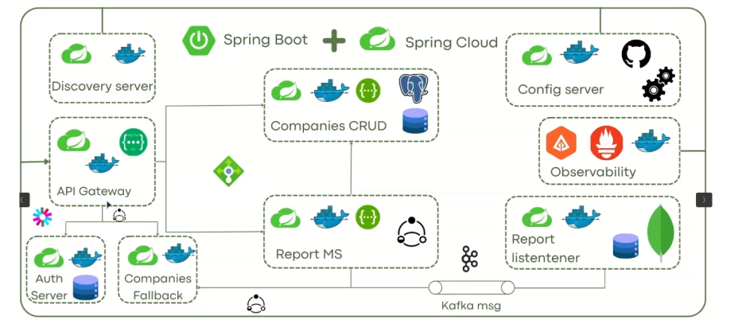

# SpringCloud

This project implements the infrastructure to enable microservices to communicate, ensuring security and resilience through Spring Cloud.

Implementing the following components:

1. Service discovery / Service registry ( Eureka client y Eureka Server)
2. Config server (Spring Cloud config)
3. Load balancer (Feign)
4. Gateway (Spring cloud Gateway)
5. Circuit breaker (Spring Cloud Circuit Breaker)
6. Streaming :kafka(spring-cloud-starter-stream)7. Traceability (Open-telemetry , zipkin)

Docker Compose already exists, but it uses pre-made images of each service. So, we need to create those images first.
